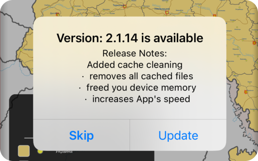

# Up2Dater

[](https://cocoapods.org/pods/Up2Dater)
[](https://cocoapods.org/pods/Up2Dater)
[](https://cocoapods.org/pods/Up2Dater)

## Requirements



* your App should be already presented in the AppStore (to fetch info from there)

 · `Skip` action stores the `skip version` into the UserDefaults and will not buggin user with this version anymore
 
 · `Update` action  brings the user to the AppStore, to fetch an update
 
## Installation

Up2Dater is available through [CocoaPods](https://cocoapods.org). To install
it, simply add the following line to your Podfile:

```ruby
pod 'Up2Dater'
```

## Usage
```swift
/// import lib
import Up2Dater

/// allocate instance
let versionManager = AppStoreVersionManager()

override func viewDidLoad() {
    super.viewDidLoad()
    observeAppState()
}

/// connetect app state observer
func observeAppState() {
    NotificationCenter.default.addObserver(
        self,
        selector: #selector(willEnterForeground),
        name: UIApplication.willEnterForegroundNotification,
        object: nil
    )
}

/// calls every time when app goes foreground
@objc
func willEnterForeground() {
    versionManager.checkNewVersionAfter { [weak self] result in
        switch result {
            case .success(let version):
                guard let version = version else { return }
                self?.presentUpdateAlert(for: version)
            case .failure(let error):
                Logger.log(error.description)
        }
    }
}

func checkNewVersion() {
    versionManager.checkNewVersionAfter { [weak self] result in
        switch result {
            case .success(let version):
                guard let version = version else { return }
                    /// run to main thread
                    DispatchQueue.main.async {
                        self?.presentUpdateAlert(for: version)
                    }
            case .failure(let error):
                print(error.description)
        }
    }
}
```
that's all 🙂


## Alert Example

```swift
    func presentUpdateAlert(for appStoreVersion: AppStoreVersion) {
        let alertTitle = "Version: \(appStoreVersion.version) is available"
        let message = """
            Release Notes:
            \(appStoreVersion.releaseNotes)
        """
        let alert = UIAlertController(
            title: alertTitle,
            message: message,
            preferredStyle: .alert
        )
        let cancelAction = UIAlertAction(title: "Skip", style: .cancel) { [weak self] _ in
            self?.versionManager.setSkipVersion(appStoreVersion.version)
        }
        let updateAction = UIAlertAction(title: "Update", style: .default) { _ in
            if let url = URL(string: appStoreVersion.appStorePath) {
                UIApplication.shared.open(url)
            }
        }
        alert.addAction(updateAction)
        alert.addAction(cancelAction)
        present(alert, animated: true)
    }
```

## Code Structure

`AppStoreVersionManager` 

main class

`public typealias VersionCompletion = (Result<AppStoreVersion?, AppStoreVersionError>) -> ()`

completion block

`public func checkNewVersion(with completion: @escaping VersionCompletion)`

base call

`public func checkNewVersionAfter(deadline: DispatchTime = .now() + 3.0, completion: @escaping  VersionCompletion)`

base call with `dispatch after` to make a delayed call:

`public func setSkipVersion(_ version: String)`

sets the omit version

Base model:
```swift
public struct AppStoreVersion {
    let appId: String
    public let version: String
    public let releaseNotes: String
    public let appStorePath: String
    
    init(appId: String, version: String, releaseNotes: String = "") {
        self.appId = appId
        self.version = version
        self.releaseNotes = releaseNotes
        self.appStorePath = "itms-apps://apple.com/app/id\(appId)"
    }
}
```

Version comparison:
```swift
extension AppStoreVersion {
    func isNewer(then bundleVersion: String) -> Bool {
        switch version.compare(bundleVersion, options: .numeric) {
            case .orderedSame,
                 .orderedAscending:
                return false
            case .orderedDescending:
                return true
        }
    }
}
```

Error Handling:
```swift
public enum AppStoreVersionError: Error {
    case bundleInfoFailure
    case bundleIdentifierFailure
    case bundleShortVersionFailure
    case appStoreURLFailure
    case urlRequestFailure(Error)
    case jsonDecodeFailure(Error)
    case invalidResponse
    case noResultInfo
    case generic(Error)
}
```

## Author

Slava Plisco, observleer@gmail.com

## License

Up2Dater is available under the MIT license. See the LICENSE file for more info.
